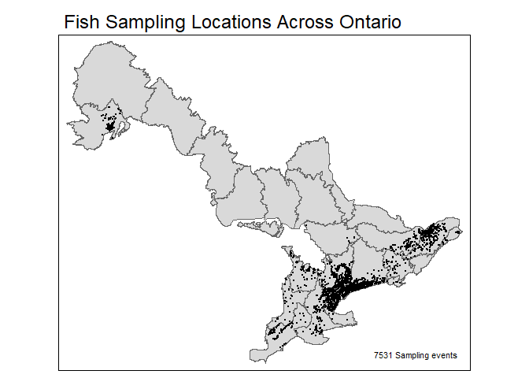
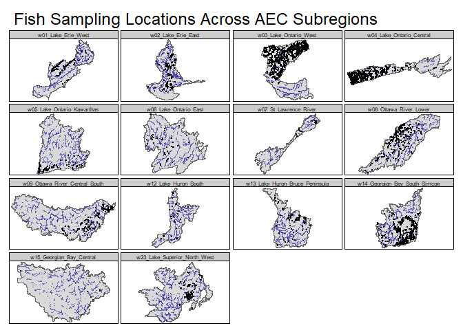

Ontario Aquatic Ecosystem Classification Biotic Modeling
================

## Objective

The goal of this project is to use data from [Ontario’s Aquatic
Ecosystem Classification
(AEC)](https://geohub.lio.gov.on.ca/maps/mnrf::aquatic-ecosystem-classification-aec-for-ontario/about)
together with [Flowing Waters Information System
(FWIS)](https://www.comap.ca/fwis/) to develop predictive models of fish
and benthic invertebrate communities across Ontario.

    ## ── Attaching core tidyverse packages ──────────────────────── tidyverse 2.0.0 ──
    ## ✔ dplyr     1.1.2     ✔ readr     2.1.4
    ## ✔ forcats   1.0.0     ✔ stringr   1.5.0
    ## ✔ ggplot2   3.4.2     ✔ tibble    3.2.1
    ## ✔ lubridate 1.9.2     ✔ tidyr     1.3.0
    ## ✔ purrr     1.0.1     
    ## ── Conflicts ────────────────────────────────────────── tidyverse_conflicts() ──
    ## ✖ dplyr::filter() masks stats::filter()
    ## ✖ dplyr::lag()    masks stats::lag()
    ## ℹ Use the conflicted package (<http://conflicted.r-lib.org/>) to force all conflicts to become errors
    ## Linking to GEOS 3.9.3, GDAL 3.5.2, PROJ 8.2.1; sf_use_s2() is TRUE

<!-- -->

<!-- -->

## Workflow

The data required for running models is too large to store on github,
but can be downloaded from scripts included in this project.

Scripts in the R folder are numbered in the order they should be run.

## Contribute

Fork the directory and copy locally. Feel free to send pull requests to
merge changes into this main branch.
